# my manjaro

## situation before install

- sda     - 500Gb ssd
- nvme0n1 - 500Gb nvme
- sdc     - 1Tb   hdd
- sdb     - 120Gb ssd   - reserved
- sdd     - 32Gb  flash - install support

I will distribuite my system on sda, sdc e nvme0n1.

- nvme0n1 - main drive
- sda     - home folder and swap
- sdc     - for big files

I want to try btrfs futures so the system will be

- nvme0n1 - btrfs ( will be formatted )
- sda     - btrfs ( will be formatted )
- sdc     - ext4  ( won't be formatted )

## install procedure

- backup your data!
- make a live usb with manjaro kde (i have a pendrive with ventoy but whatever boot is ok)
- boot the live with proprietary driver
- install with calamares on the nvme0n1, chose:
  - automatic partitioning
  - btrfs
  - no swap
- reboot

## Right after install

install gparted with the store and let it do the updates it need.

With gparted create a new partition table for sda (be sure, there is no undo), chose GPT. Than create the swap, i have 32Gb of rab so 50Gb of swap, and the remaining space a btrfs partition.


and the output of this should be simimar.

```bash
> lsblk --fs
NAME        FSTYPE FSVER LABEL    UUID                                 FSAVAIL FSUSE% MOUNTPOINTS
sda
├─sda1      swap   1              5618d796-e5de-40ac-98ee-704cbd0d94b4                [SWAP]
└─sda2      btrfs                 8c881877-e7f4-493d-a658-5422c701aca5  394,9G     0%
sdb
├─sdb1      vfat   FAT32          5AEA-94DB
├─sdb2
├─sdb3      ntfs                  2C1AEBA61AEB6AF2
└─sdb4      ntfs                  BC52CA1152C9D076
sdc
└─sdc2      ext4   1.0            a81b9eac-926e-4b3c-a6e0-7a56d5117021
sdd
├─sdd1      exfat  1.0   Ventoy   1D1B-BDD3
└─sdd2      vfat   FAT16 VTOYEFI  36FE-745E
nvme0n1
├─nvme0n1p1 vfat   FAT32 NO_LABEL 9DC0-3A68                             298,8M     0% /boot/efi
└─nvme0n1p2 btrfs                 08c1a849-60c7-4f1b-aeca-1b2815a7cdb2  454,7G     2% /var/log
                                                                                      /var/cache
                                                                                      /home
                                                                                      /
```

### Enable swap

We created the swap partition but we neet to add it to fstab. So, edit `/ect/fstab` and add and the bottom

```bash
UUID=5618d796-e5de-40ac-98ee-704cbd0d94b4 none swap defaults 0 0
```

The uuid need to be the one of the swap partition so `sda1`

### enable ssd trim

Manjaro already have the [service](https://forum.manjaro.org/t/solved-support-of-trim-on-my-ssd-hardware/38699) for that, just enable it with

```bash
> sudo systemctl enable --now fstrim.timer
```

## Move home to sda2

After the install manjaro create automatically 4 subvolumes

```bash
> sudo btrfs subvolume list -p /
ID 259 gen 798 parent 5 top level 5 path @log
ID 263 gen 798 parent 5 top level 5 path @
ID 258 gen 749 parent 5 top level 5 path @home
ID 260 gen 608 parent 5 top level 5 path @cache
```

all of those are mounted in `/etc/fstab`

```bashj
UUID=08c1a849-60c7-4f1b-aeca-1b2815a7cdb2 /              btrfs   subvol=/@,defaults,noatime,autodefrag,compress=zstd 0 0
UUID=08c1a849-60c7-4f1b-aeca-1b2815a7cdb2 /home          btrfs   subvol=/@home,defaults,noatime,autodefrag,compress=zstd 0 0
UUID=08c1a849-60c7-4f1b-aeca-1b2815a7cdb2 /var/cache     btrfs   subvol=/@cache,defaults,noatime,autodefrag,compress=zstd 0 0
UUID=08c1a849-60c7-4f1b-aeca-1b2815a7cdb2 /var/log       btrfs   subvol=/@log,defaults,noatime,autodefrag,compress=zstd 0 0
```

The uuid is always the same because they are all on `nvme0n1p2`.

We will move `@home` and `@cache` to sda2 to save space in the root ssd.

### move home to second ssd

I will follow [this](https://www.reddit.com/r/btrfs/comments/iqmbgi/comment/g4szgdl/?utm_source=share&utm_medium=web2x&context=3) for most of the steps

create mountpoint for sda2 ( name doesn't matter)

```bash
> sudo mkdir /data/ssd
```

mount the partition

```bash
> mount /dev/sda2 /data/ssd
```

Now we can check if the system recognize it.

```bash
> sudo btrfs filesystem show
Label: none  uuid: 08c1a849-60c7-4f1b-aeca-1b2815a7cdb2
        Total devices 1 FS bytes used 9.07GiB
        devid    1 size 465.46GiB used 11.02GiB path /dev/nvme0n1p2

Label: none  uuid: 8c881877-e7f4-493d-a658-5422c701aca5
        Total devices 1 FS bytes used 236.86MiB
        devid    1 size 397.13GiB used 3.02GiB path /dev/sda2
```

home is a subvolume of /

```bash
> sudo btrfs subvolume list / |grep home
ID 257 gen 313 top level 5 path @home
```

To move it to another drive we need to create a snapshot and copy it to the second drive.

```bash
> sudo btrfs subvolume snapshot -r /home /home_snap
Create a readonly snapshot of '/home' in '//home_snap'
```

```bash
> btrfs filesystem sync /
```

Now we have 2 subvolume, `@home` and `home_snap`

```bash
> sudo btrfs subvolume list / |grep home
ID 257 gen 313 top level 5 path @home
ID 255 gen 315 top level 5 path home_snap
```

Send the readonly snapshot to new drive which is mounted as `/data/ssd`

```bash
> btrfs send /home_snap | btrfs receive /data/ssd
```

```bash
> btrfs filesystem sync /data/ssd
```

Now rename it to desired name and made it read-write

```bash
> sudo btrfs subvolume snapshot /data/ssd/home_snap /data/ssd/@home
Create a snapshot of '/data/ssd/home_snap' in '/data/ssd/@home'
```

Removed unnecessary snapshots

```bash
> btrfs subvolume delete /data/ssd/home_snap /home_snap
```

update `/etc/fstab`

```bash
UUID=9DC0-3A68                            /boot/efi      vfat    umask=0077 0 2
UUID=08c1a849-60c7-4f1b-aeca-1b2815a7cdb2 /              btrfs   subvol=/@,defaults,noatime,autodefrag,compress=zstd 0 0

# need to update this line with the new uuid, but if wrong the pc will not boot, so for fast recovery leave it commented and copy past it to the bottom
#UUID=08c1a849-60c7-4f1b-aeca-1b2815a7cdb2 /home          btrfs   subvol=/@home,defaults,noatime,autodefrag,compress=zstd 0 0

UUID=08c1a849-60c7-4f1b-aeca-1b2815a7cdb2 /var/cache     btrfs   subvol=/@cache,defaults,noatime,autodefrag,compress=zstd 0 0
UUID=08c1a849-60c7-4f1b-aeca-1b2815a7cdb2 /var/log       btrfs   subvol=/@log,defaults,noatime,autodefrag,compress=zstd 0 0


# this is the new line, the uuid is of /dev/sda2 (same as above)
UUID=8c881877-e7f4-493d-a658-5422c701aca5 /home          btrfs   subvol=/@home,defaults,noatime,autodefrag,compress=zstd 0 0


UUID=5618d796-e5de-40ac-98ee-704cbd0d94b4 none swap defaults 0 0
```

now reboot and if it boot

```bash
NAME        FSTYPE FSVER LABEL    UUID                                 FSAVAIL FSUSE% MOUNTPOINTS
sda
├─sda1      swap   1              5618d796-e5de-40ac-98ee-704cbd0d94b4                [SWAP]
└─sda2      btrfs                 8c881877-e7f4-493d-a658-5422c701aca5  394,9G     0% /home

sdb
├─sdb1      vfat   FAT32          5AEA-94DB
├─sdb2
├─sdb3      ntfs                  2C1AEBA61AEB6AF2
└─sdb4      ntfs                  BC52CA1152C9D076
sdc
└─sdc2      ext4   1.0            a81b9eac-926e-4b3c-a6e0-7a56d5117021
sdd
├─sdd1      exfat  1.0   Ventoy   1D1B-BDD3
└─sdd2      vfat   FAT16 VTOYEFI  36FE-745E
nvme0n1
├─nvme0n1p1 vfat   FAT32 NO_LABEL 9DC0-3A68                             298,8M     0% /boot/efi
└─nvme0n1p2 btrfs                 08c1a849-60c7-4f1b-aeca-1b2815a7cdb2  454,7G     2% /var/log
                                                                                      /var/cache
                                                                                      /
```

we see that home is under `sda2`, check if everything is there!

To remove the old subvolume `/@home` we need to:

```bash
> sudo mkdir /data/temp
> sudo mount -o subvolid=0 /dev/nvme0n1p2 /data/temp
> sudo btrfs subvolume delete /data/temp/@home
```

and than reboot.

### move cache to second ssd

currently we have

```bash
> sudo btrfs subvolume list /
ID 256 gen 388 top level 5 path @
ID 258 gen 383 top level 5 path @cache
ID 259 gen 388 top level 5 path @log
```

The step are similar to the one above:

```bash
> sudo btrfs subvolume snapshot -r /var/cache /var/cache_snap
Create a readonly snapshot of '/var/cache' in '/var/cache_snap'
```

```bash
> btrfs filesystem sync /
```

```bash
> sudo mount /dev/sda2 /data/ssd
```

```bash
> sudo btrfs send /var/cache_snap | sudo btrfs receive /data/ssd
At subvol /var/cache_snap
At subvol cache_snap
```

```bash
> btrfs filesystem sync /data/ssd
```

```bash
> sudo btrfs subvolume snapshot /data/ssd/cache_snap /data/ssd/@cache
Create a snapshot of '/data/ssd/cache_snap' in '/data/ssd/@cache'
```

```bash
> sudo btrfs subvolume delete /data/ssd/cache_snap /var/cache_snap
Delete subvolume (no-commit): '/data/ssd/cache_snap'
Delete subvolume (no-commit): '/var/cache_snap'
```

update fstab

```bash
> vim /etc/fstab
UUID=9DC0-3A68                            /boot/efi      vfat    umask=0077 0 2
UUID=08c1a849-60c7-4f1b-aeca-1b2815a7cdb2 /              btrfs   subvol=/@,defaults,noatime,autodefrag,compress=zstd 0 0
# UUID=08c1a849-60c7-4f1b-aeca-1b2815a7cdb2 /home          btrfs   subvol=/@home,defaults,noatime,autodefrag,compress=zstd 0 0
# UUID=08c1a849-60c7-4f1b-aeca-1b2815a7cdb2 /var/cache     btrfs   subvol=/@cache,defaults,noatime,autodefrag,compress=zstd 0 0
UUID=08c1a849-60c7-4f1b-aeca-1b2815a7cdb2 /var/log       btrfs   subvol=/@log,defaults,noatime,autodefrag,compress=zstd 0 0


UUID=8c881877-e7f4-493d-a658-5422c701aca5 /home          btrfs   subvol=/@home,defaults,noatime,autodefrag,compress=zstd 0 0
UUID=8c881877-e7f4-493d-a658-5422c701aca5 /var/cache     btrfs   subvol=/@cache,defaults,noatime,autodefrag,compress=zstd 0 0


UUID=5618d796-e5de-40ac-98ee-704cbd0d94b4 none swap defaults 0 0
```

reboot!

and now we have `@cache` on the ssd too

```bash
> lsblk --fs
NAME        FSTYPE FSVER LABEL    UUID                                 FSAVAIL FSUSE% MOUNTPOINTS
sda
├─sda1      swap   1              5618d796-e5de-40ac-98ee-704cbd0d94b4                [SWAP]
└─sda2      btrfs                 8c881877-e7f4-493d-a658-5422c701aca5  394,5G     0% /var/cache
                                                                                      /home
sdb
├─sdb1      vfat   FAT32          5AEA-94DB
├─sdb2
├─sdb3      ntfs                  2C1AEBA61AEB6AF2
└─sdb4      ntfs                  BC52CA1152C9D076
sdc
└─sdc2      ext4   1.0            a81b9eac-926e-4b3c-a6e0-7a56d5117021
nvme0n1
├─nvme0n1p1 vfat   FAT32 NO_LABEL 9DC0-3A68                             298,8M     0% /boot/efi
└─nvme0n1p2 btrfs                 08c1a849-60c7-4f1b-aeca-1b2815a7cdb2  454,9G     2% /var/log
                                                                                      /
```

we still need to delete the old one

```bash
> sudo mount -o subvolid=0 /dev/nvme0n1p2 /data/temp
> sudo btrfs subvolume delete /data/temp/@cache
```

reboot again to confirm the everithing is ok

## basic programs

- gimp      ( official repo )
- telegram  ( official repo )
- alacritty ( official repo )
- redshift  ( official repo )
- xclip     ( official repo ) - is needed by the vscode extensions
- vscode    ( aur - visual-studio-code-bin )
- redshift tray icon ( aur - [plasma5-applets-redshift-control-git](https://aur.archlinux.org/packages/plasma5-applets-redshift-control-git/) )

### error fixup

While installing things i got a lot this type of error in the log of pamac:

```bash
ftp://mirror.easyname.at/manjaro/stable/core/x86_64/core.db: Operation not supported
```

and after searching around:

```bash
sudo pacman-mirrors --country all --api --protocols all --set-branch stable && sudo pacman -Syyu
```

this will requery all mirrors ( can take a while )

### redshift config

To add the tray icon as plasma widget:

1. go into edit panel mode

    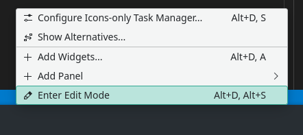

2. press on add widgets

    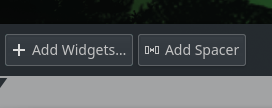

3. search for the redshift one

    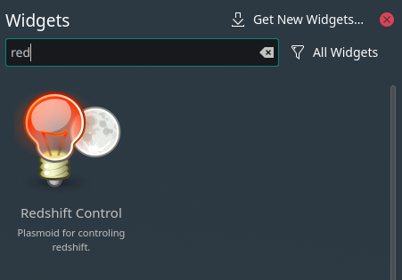

4. drag and frop it on the panel

    

5. to configure it, righclick and:

    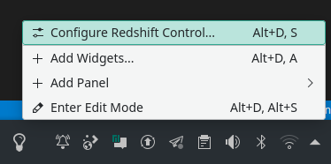
    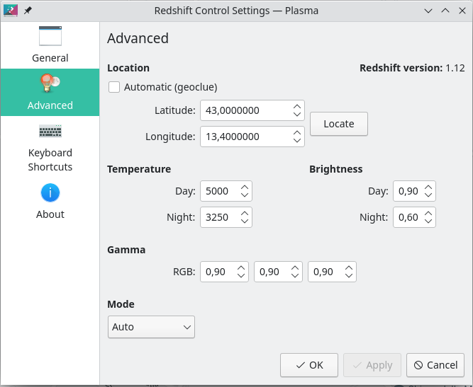

### vscode basic config ( needed to edit this file )

install the "markdown" and "paste-image" extensions:

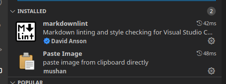

this allows basic markdown edit and the ability to paste screenshot from Spectacle directly into vscode.

## Pipewire and sound test

Install:

- `manjaro-pipewire` - Officail repo
- `spotify`          - Aur

from the store, it will remove a bunch of pakages and install some others.

Now reboot and test the audio.

### errors fixup

If you get:

```bash
==> Validating source files with sha512sums...
    spotify.protocol ... Passed
    LICENSE ... Passed
    spotify-1.1.72.439-x86_64.deb ... Passed
    spotify-1.1.72.439-3-Release ... Skipped
    spotify-1.1.72.439-3-Release.sig ... Skipped
    spotify-1.1.72.439-3-x86_64-Packages ... Skipped
==> Verifying source file signatures with gpg...
    spotify-1.1.72.439-3-Release ... FAILED (unknown public key 5E3C45D7B312C643)
==> ERROR: One or more PGP signatures could not be verified!
Failed to build spotify
```

Check on the [aur page](https://aur.archlinux.org/packages/spotify):

```bash
> curl -sS https://download.spotify.com/debian/pubkey_5E3C45D7B312C643.gpg | gpg --import -
```

And rebuild.

With pipewire you can select the codec for every device.

## Firefox setup

If you have your old profile folder:

1. launch firefox from terminal with `firefox -P`, deselect the checkbox
2. press crate profile and name it what you want
3. start firefox and go to help -> Troubleshooting information -> profile directory -> open directory
4. go one level back with the directories:

    ```bash
    56cnzqg5.default  
    'Crash Reports'  
    installs.ini   
    o0txjmgx.default-release  
    'Pending Pings'   
    profiles.ini   
    sav6owru.general   
    xp5m27qq.work-cloe
    ```

5. close every instance of firefox
6. open the pofile you have just created and paste the content of the your backup, overwrite everithing
7. reopen firefox and it should ask what profile you want to open, otherwhise lunch it with `firefox -P`

## plasma setup

### panel

edit the panel to have:


1. application launcher
2. global menu
3. spacer
4. icon only task manager
   - in settings select:
        - do not group
        - sort alphabetically
        - clik the active task does nothing
        - middle click does nothing
        - mouse whell does nothing
        - show only task from current desktop
5. spacer
6. pager
7. redshift control
8. caffeine plus
9. system tray
10. digital clock

### tiling

install [`kwin-bismuth`](https://github.com/Bismuth-Forge/bismuth) from aur, than:

1. go to settings -> workspace behavior -> virtual desktops, select 4 rows and add 5 desktop for every row. 20 desktop total
2. windown managment -> window tiling -> enable tiling
3. next we need to take care of the shortcuts
    - Alacritty
       - New=Meta+Return
    - kwin
        - Window Close=Meta+Shift+Q
        - Switch One Desktop Down=Meta+Down
        - Switch One Desktop Up=Meta+Up
        - Switch One Desktop to the Left=Meta+Left
        - Switch One Desktop to the Right=Meta+Right
        - Switch Window Down=Meta+Alt+Down
        - Switch Window Left=Meta+Alt+Left
        - Switch Window Right=Meta+Alt+Right
        - Switch Window Up=Meta+Alt+Up
        - Window One Desktop Down=Meta+Ctrl+Shift+Down
        - Window One Desktop Up=Meta+Ctrl+Shift+Up
        - Window One Desktop to the Left=Meta+Ctrl+Shift+Left
        - Window One Desktop to the Right=Meta+Ctrl+Shift+Right
        - Window Fullscreen=Meta+Alt+F
        - bismuth_next_layout=Meta+\\
        - bismuth_prev_layout=Meta+|
        - bismuth_rotate=Meta+R
        - bismuth_rotate_part=Meta+Shift+R
        - ExposeAll=Meta+Ctrl+Tab
        - ShowDesktopGrid=Meta+Tab
    - spectacle
        - RectangularRegionScreenShot=Meta+Shift+S

## google integration

1. install `kio-gdrive`
2. go to setting -> online accounts -> add google
3. select drive
4. now you have drive in dolphin -> network -> google drive
5. for calendar install `KOrganizer` and configure it

## vscode settings

1. install `gnome-keyring`
2. login on vscode with github
3. for the font:
    1. install `ttf-fira-code`
    2. restart vscode, for any error see [this](https://github.com/tonsky/FiraCode/wiki/VS-Code-Instructions)
4. if the font in the terminal is wrong edit in the settings

    ```json
    "terminal.integrated.fontFamily": "Fira Code",
    ```

5. for spellright:
    1. install `hunspell-en_US` and `hunspell-it`
    2. confirm that the dictionaries are present in `/usr/share/hunspell/*`
    3. `mkdir ~/.config/Code/Dictionaries`
    4. `ln -s /usr/share/hunspell/* ~/.config/Code/Dictionaries`
    5. select the dictioraries from the eye like icon in the lower right

## git and github

install `gnome-keyring` and run:

```bash
> git config --global credential.helper /usr/lib/git-core/git-credential-libsecret
```

## mouse

1. install `Solaar`
2. install `logiops-git` ( or `logiops` depending on the state of the project )
3. create a file in `/etc/logid.cfg`

    ```nagios
    devices: ({
        name: "Wireless Mouse MX Master 3";

        // A lower threshold number makes the wheel switch to free-spin mode
        // quicker when scrolling fast.
        smartshift:
        {
            on: true;
            threshold: 17;
        };

        hiresscroll:
        {
            hires: false;
            invert: false;
            target: true;
            up: {
                mode: "Axis";
                axis: "REL_WHEEL";
                axis_multiplier: 2.5;
            },
            down: {
                mode: "Axis";
                axis: "REL_WHEEL";
                axis_multiplier: -2.5;
            },
        };

        // Higher numbers make the mouse more sensitive (cursor moves faster),
        // 4000 max for MX Master 3.
        dpi: 1750;
        timeout = 500;

        buttons: (
        // Make thumb button 10.
        {
            cid: 0xc3;
            action =
            {
                type: "Gestures";
                gestures: (
                {
                    direction: "Up";
                    mode: "OnRelease";
                    action =
                    {
                        type: "Keypress";
                        keys: ["KEY_LEFTMETA", "KEY_UP"];
                    };
                },
                {
                    direction: "Down";
                    mode: "OnRelease";
                    action =
                    {
                        type: "Keypress";
                        keys: ["KEY_LEFTMETA", "KEY_DOWN"];
                    };
                },
                {
                    direction: "Left";
                    mode: "OnRelease";
                    action =
                    {
                        type: "Keypress";
                        keys: ["KEY_LEFTMETA", "KEY_LEFT"];
                    };
                },
                {
                    direction: "Right";
                    mode: "OnRelease";
                    action =
                    {
                        type: "Keypress";
                        keys: ["KEY_LEFTMETA", "KEY_RIGHT"];
                    };
                },
                {
                        direction: "None"
                        mode: "OnRelease"
                        action =
                        {
                            type: "Keypress";
                            keys: ["KEY_LEFTMETA", "KEY_TAB"];
                        };
                }
                );
            }
        },
        {
            cid: 0xc4;
            action =
                {
                    type: "Gestures";
                    gestures: (
                        {
                        direction: "None";
                        mode: "OnRelease";
                        action =
                            {
                                type: "Keypress";
                                keys: [ "KEY_LEFTMETA", "KEY_F" ];
                            }
                        },

                        {
                        direction: "Up";
                        mode: "OnRelease";
                        action =
                            {
                                type: "Keypress";
                                keys: [ "KEY_LEFTMETA", "KEY_BACKSLASH" ];
                            }
                        },

                        {
                        direction: "Down";
                        mode: "OnRelease";
                        action =
                            {
                                type: "Keypress";
                                keys: [ "KEY_LEFTMETA", "KEY_LEFTSHIFT", "KEY_BACKSLASH" ];
                            }
                        },

                        {
                        direction: "Left";
                        mode: "OnRelease";
                        action =
                            {
                                type: "Keypress";
                                keys: [ "KEY_LEFTMETA", "KEY_K" ];
                            }
                        },

                        {
                        direction: "Right";
                        mode: "OnRelease";
                        action =
                            {
                                type: "Keypress";
                                keys: [ "KEY_LEFTMETA", "KEY_J" ];
                            }
                        }
                    );
                };
        }
        );

        thumbwheel:
        {
            divert: true;
            invert: true;

            left: {
                mode: "Axis";
                axis: "REL_HWHEEL";
                axis_multiplier: 0.5;
            },
            right: {
                mode: "Axis";
                axis: "REL_HWHEEL";
                axis_multiplier: -0.5;
            },

            tap: {
                type: "Keypress";
                keys: ["KEY_LEFTMETA", "KEY_LEFTCTRL", "KEY_TAB"];
            };
        };

    }
    );
    ```

    this will configure:
    - the gesture on the thumb button to change desktop and see the grid of desktops
    - the side whell to display the expose on touch
    - the upper small button to interact with the tiling, make a window floating and change layout to the tiling structure
    - STILL need to configure the back and forward button, they support gestures too

## mpv

1. install mpv
2. in the folder `~/.config/mpv`
    - `input.conf`

        ```conf
        UP add volume +2
        DOWN add volume -2

        WHEEL_UP add volume +2
        WHEEL_DOWN add volume -2

        Alt+- add video-zoom -0.05
        Alt++ add video-zoom 0.05

        Alt+i add video-pan-y 0.01
        Alt+k add video-pan-y -0.01
        Alt+j add video-pan-x 0.01
        Alt+l add video-pan-x -0.01
        ```

    - `mpv.conf`

        ```conf
        volume=50
        save-position-on-quit


        profile=gpu-hq
        scale=ewa_lanczossharp
        cscale=ewa_lanczossharp
        video-sync=display-resample
        interpolation
        tscale=oversample
        ```

## ssh config

1. copy your private and public key from the backup into `~/.ssh`
2. create `~/.ssh/config`

    ```config
    Host deep-learning.test-cloe.com
        HostName deep-learning.test-cloe.com
        User ubuntu

    Host server
        HostName 195.32.66.195
        #User simonoe
        Port 29902
        IdentityFile ~/.ssh/id_rsa
        ConnectTimeout 40
        LocalForward 8080 localhost:8080    # qbittorrent
        LocalForward 9117 localhost:9117    # Jackett
        LocalForward 32400 localhost:32400  # plex
        LocalForward 9090 localhost:9090    # munin
        LocalForward 5900 localhost:5900    # meld vnc
        LocalForward 53682 localhost:53682  # meld vnc
        LogLevel QUIET


    Host meld
        HostName 195.32.66.195
        Port 2150
        User root
        ForwardX11 yes
        ForwardX11Trusted yes
    ```

3. make sure the permission for the private key are restrictive

    ```bash
    total 12
    drwxr-xr-x 1 simone simone   44 30 dic 16.06 .
    drwx------ 1 simone simone  560 30 dic 16.06 ..
    -rw------- 1 simone simone  639 13 dic 16.59 config
    -rw------- 1 simone simone 3389 27 giu  2021 id_rsa
    -rw-r--r-- 1 simone simone  750 27 giu  2021 id_rsa.pub
    ```

## system focus

To have the focus _always_ under the mouse set:

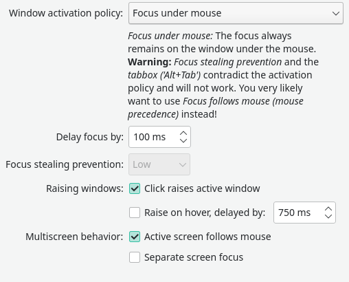

## automount of hdd

to automount the hdd ondemand when is needed we need to use a systemd unit.

1. create mountpoint: `sudo mkdir /data/hdd`
2. add to `/etc/fstab`

    ```fstab
    UUID=a81b9eac-926e-4b3c-a6e0-7a56d5117021 /data/hdd ext4 noauto,x-systemd.automount 0 0
    ```

3. to verify that the `fstab` is correct run:

    ```bash
    sudo findmnt --verify --verbose
    ```

## backup of home folder

1. install back in time
2. create a backup folder in `/data/hdd` and chown to you

    ```bash
    sudo mkdir /data/hdd/home-backup
    sudo chown simone home-backup/
    ```

3. link the folder to home

    ```bash
    ln -s /data/hdd/home-backup/ ~/.backup
    ```

4. configure back in time:

    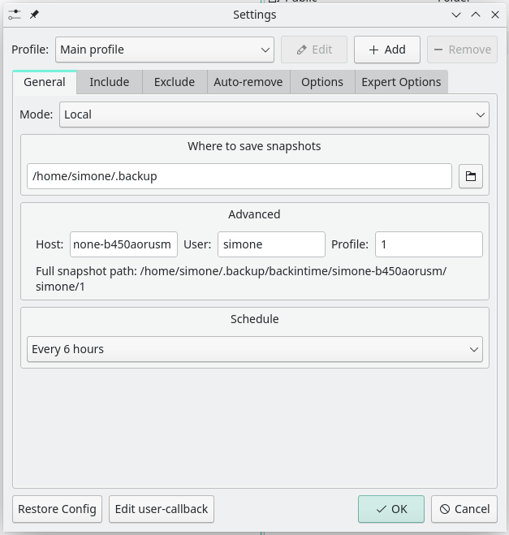

    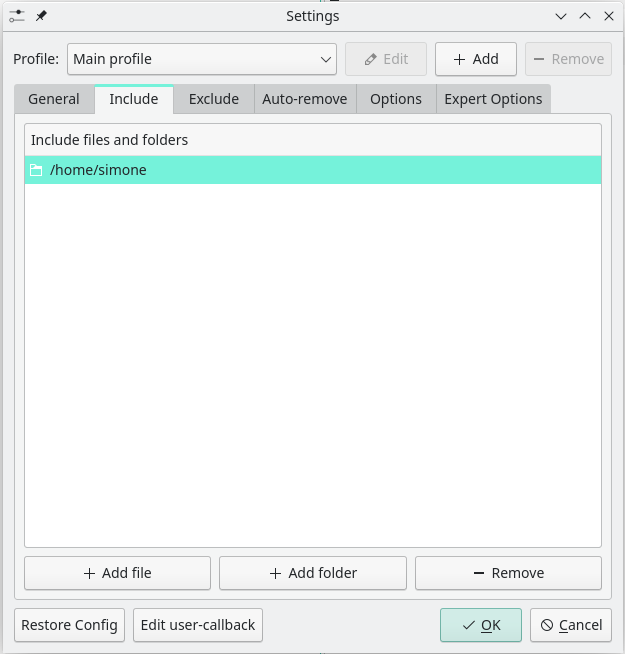

    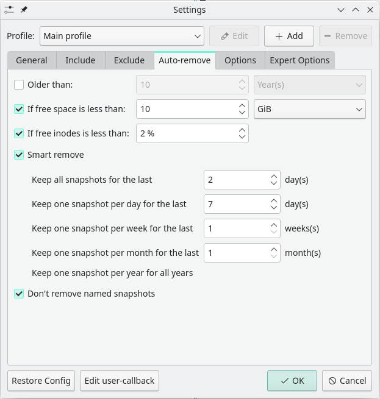

## zsh config

1. make sure your default shell is zsh

    ```bash
    chsh -s /bin/zsh
    ```

2. install oh-my-zsh

    ```bash
    sh -c "$(curl -fsSL https://raw.github.com/robbyrussell/oh-my-zsh/master/tools/install.sh)"
    ```

3. install required fonts
    - ttf-meslo-nerd-font-powerlevel10k
    - powerline-fonts
4. install `zsh-theme-powerlevel10k-git`
5. run:

    ```bash
    echo 'source /usr/share/zsh-theme-powerlevel10k/powerlevel10k.zsh-theme' >>~/.zshrc
    ```

6. change font in alacritty

    ```bash
    > mkdir ~/.config/alacritty/
    > vim ~/.config/alacritty/alacritty.yml
    font:
      normal:
        family: "MesloLGS NF"
    ```

7. open a terminal and follow Instructions

    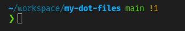

8. install [colorls](https://github.com/athityakumar/colorls)
    1. `gem install colorls`
    2. add to `.zshrc`

        ```bash
        # add ruby to path
        export PATH="/home/simone/.local/share/gem/ruby/3.0.0/bin:$PATH"

        source $(dirname $(gem which colorls))/tab_complete.sh

        alias lc='colorls -lAh --sd'
        alias ls='colorls'
        alias la='colorls -lAh'
        alias lg='colorls --gs'
        ```

9. [zsh-syntax-highlighting](https://github.com/zsh-users/zsh-syntax-highlighting/blob/master/INSTALL.md)
    1. run

        ```bash
        > git clone https://github.com/zsh-users/zsh-syntax-highlighting.git ${ZSH_CUSTOM:-~/.oh-my-zsh/custom}/plugins/zsh-syntax-highlighting
        ```

    2. Activate the plugin in ~/.zshrc:

        ```bash
        plugins=( [plugins...] zsh-syntax-highlighting)
        ```

10. [zsh-autosuggestions](https://github.com/zsh-users/zsh-autosuggestions/blob/master/INSTALL.md)
    1. run

        ```bash
        git clone https://github.com/zsh-users/zsh-autosuggestions ${ZSH_CUSTOM:-~/.oh-my-zsh/custom}/plugins/zsh-autosuggestions
        ```

    2. Add the plugin to the list of plugins for Oh My Zsh to load (inside ~/.zshrc):

        ```bash
        plugins=( 
            # other plugins...
            zsh-autosuggestions
        )
        ```

11. [zsh-completions](https://github.com/zsh-users/zsh-completions)
    1. run:

        ```bash
        git clone https://github.com/zsh-users/zsh-completions ${ZSH_CUSTOM:=~/.oh-my-zsh/custom}/plugins/zsh-completions
        ```

    2. Enable it in your .zshrc by adding it to your plugin list and reloading the completion:

        ```bash
        plugins=(… zsh-completions)
        autoload -U compinit && compinit
        ```

12. install [fzf](https://github.com/junegunn/fzf)
    1. intsall `fzf` -> official repo
    2. add to `~/.zshrc`

        ```bash
        export FZF_CTRL_T_OPTS="--preview '(highlight -O ansi -l {} 2> /dev/null || cat {} || tree -C {}) 2> /dev/null | head -200'"
        export FZF_CTRL_T_OPTS="--select-1 --exit-0"
        export FZF_CTRL_R_OPTS="--preview 'echo {}' --preview-window down:3:hidden:wrap --bind '?:toggle-preview'"

        fzf-history-widget-accept() {
            fzf-history-widget
            zle accept-line
        }
        zle     -N     fzf-history-widget-accept
        bindkey '^X^R' fzf-history-widget-accept

        source "/usr/share/fzf/key-bindings.zsh"
        source "/usr/share/fzf/completion.zsh"
        ```

13. vim tab fix, for default vim use 8 spaces tab. create `~/.vimrc`:

    ```bash
    source /etc/vimrc
    source $VIMRUNTIME/defaults.vim


    set tabstop=4       " The width of a TAB is set to 4.
                        " Still it is a \t. It is just that
                        " Vim will interpret it to be having
                        " a width of 4.

    set shiftwidth=4    " Indents will have a width of 4

    set softtabstop=4   " Sets the number of columns for a TAB

    set expandtab       " Expand TABs to spaces
    ```

    the first 2 lines are needed to not lose the default configuration, the paths can be recovered running `:version` in a vim editor.

14. [zsh-z](https://github.com/agkozak/zsh-z)
    1. run:

        ```bash
        git clone https://github.com/agkozak/zsh-z $ZSH_CUSTOM/plugins/zsh-z
        ```

    2. add to plugins:

        ```bash
        plugins=(
            git
            zsh-syntax-highlighting
            zsh-autosuggestions
            zsh-completions
            zsh-z
        )
        ```

15. other plugings:

    just add them to the plugin list:

    ```bash
        plugins=(
        zsh-interactive-cd
        git
        zsh-syntax-highlighting
        zsh-autosuggestions
        zsh-completions
        zsh-z
        colored-man-pages
        docker
        docker-compose
        aliases
        aws
        command-not-found
        extract
        fzf
        git-auto-fetch
        gitignore
        jsontools
        rsync
        systemd
    )
    ```

16. before `source oh-my-zsh`:

    ```bash
    autoload -U compinit && compinit
    export FZF_BASE=/usr/bin/fzf

    source $ZSH/oh-my-zsh.sh
    ```

17. cheat:

    add at the end of `.zshrc`

    ```bash
    cheat() {
        curl -s cheat.sh/$1 | less
    }
    ```

18. docker-cleanup:

    add at the end of `zshrc`

    ```bash
    docker-cleanup () {
        docker container prune -f --filter "until=300h"
        docker image prune -f -a --filter "until=300h"
        docker volume prune -f --filter "label!=keep"
        docker network prune -f --filter "until=300h"
    }
    ```

19. alacritty themes ( #! WORK IN PROGRESS )
    1. install `alacritty-colorscheme`

        ```bash
        pip install --user alacritty-colorscheme
        ```

    2. run:

        ```bash
        mkdir ~/.alacritty-themes

        REPO="https://github.com/aaron-williamson/base16-alacritty.git"
        DEST="~/.alacritty-themes/aarors-williamson-colorschemes"
        git clone $REPO $DEST
        ln ~/.alacritty-themes/aarors-williamson-colorschemes/colors/* "$HOME/.config/alacritty/colors/"

        REPO="https://github.com/eendroroy/alacritty-theme.git"
        DEST="~/.alacritty-themes/eendroroy-colorschemes"
        git clone $REPO $DEST
        ln ~/.alacritty-themes/eendroroy-colorschemes/themes/* "$HOME/.config/alacritty/colors/"
        ```

    3. chose your theme and add to `.zshrc`:

        ```bash
        LIGHT_COLOR='base16-equilibrium-gray-light.yml'
        DARK_COLOR='base16-onedark.yml'

        alias day="alacritty-colorscheme -V apply $LIGHT_COLOR"
        alias night="alacritty-colorscheme -V apply $DARK_COLOR"
        alias toggle="alacritty-colorscheme -V toggle $LIGHT_COLOR $DARK_COLOR"
        ```

        to fix the colors in vim and use the `one_dark.yaml` theme do:

        1. copy the `base16-onedark.yml` and keep the copy as a backup

            ```bash
            cd .config/alacritty/colors
            cp -L base16-onedark{,-b}.yml
            ```

        2. edit the `base16-onedark.yml` and change the colors from `one_dark.yaml`

            ```yml
            # Base16 OneDark - alacritty color config
            # Lalit Magant (http://github.com/tilal6991)
            colors:
            # Default colors
            primary:
                background: '0x1e2127' # '0x282c34'
                foreground: '0xabb2bf'

            # Colors the cursor will use if `custom_cursor_colors` is true
            cursor:
                text: '0x1e2127' # '0x282c34'
                cursor: '0xabb2bf'

            # Normal colors
            normal:
                black:   '0x1e2127' # '0x282c34'
                red:     '0xe06c75'
                green:   '0x98c379'
                yellow:  '0xd19a66' # '0xe5c07b'
                blue:    '0x61afef'
                magenta: '0xc678dd'
                cyan:    '0x56b6c2'
                white:   '0xabb2bf'

            # Bright colors
            bright:
                black:   '0x5c6370' # '0x545862'
                red:     '0xe06c75'
                green:   '0x98c379'
                yellow:  '0xd19a66' # '0xe5c07b'
                blue:    '0x61afef'
                magenta: '0xc678dd'
                cyan:    '0x56b6c2'
                white:   '0xffffff' # '0xc8ccd4'


            draw_bold_text_with_bright_colors: false
            ```

        3. edit `~/.vimrc`

            ```vim
            Plugin 'chriskempson/base16-vim'

            " The following are examples of different formats supported.
            " Keep Plugin commands between vundle#begin/end.
            " plugin on GitHub repo
            "Plugin 'tpope/vim-fugitive'
            " plugin from http://vim-scripts.org/vim/scripts.html
            " Plugin 'L9'
            " Git plugin not hosted on GitHub
            "Plugin 'git://git.wincent.com/command-t.git'
            " git repos on your local machine (i.e. when working on your own plugin)
            "Plugin 'file:///home/gmarik/path/to/plugin'
            " The sparkup vim script is in a subdirectory of this repo called vim.
            " Pass the path to set the runtimepath properly.
            "Plugin 'rstacruz/sparkup', {'rtp': 'vim/'}
            " Install L9 and avoid a Naming conflict if you've already installed a
            " different version somewhere else.
            " Plugin 'ascenator/L9', {'name': 'newL9'}

            " All of your Plugins must be added before the following line
            call vundle#end()            " required
            filetype plugin indent on    " required
            " To ignore plugin indent changes, instead use:
            "filetype plugin on
            "
            " Brief help
            " :PluginList       - lists configured plugins
            " :PluginInstall    - installs plugins; append `!` to update or just :PluginUpdate
            " :PluginSearch foo - searches for foo; append `!` to refresh local cache
            " :PluginClean      - confirms removal of unused plugins; append `!` to auto-approve removal
            "
            " see :h vundle for more details or wiki for FAQ
            " Put your non-Plugin stuff after this line


            set tabstop=4       " The width of a TAB is set to 4.
                                " Still it is a \t. It is just that
                                " Vim will interpret it to be having
                                " a width of 4.

            set shiftwidth=4    " Indents will have a width of 4

            set softtabstop=4   " Sets the number of columns for a TAB

            set expandtab       " Expand TABs to spaces

            if filereadable(expand("~/.vimrc_background"))
                let base16colorspace=256          " Remove this line if not necessary
                source ~/.vimrc_background
            endif
            ```

        4. now when the theme change in alacritty it will change in vim too.

## fix colorls light theme ( #! WORK IN PROGRESS )

1. run:

    ```bash
    cp /home/simone/.local/share/gem/ruby/3.0.0/gems/colorls-1.4.4/lib/yaml/light_colors.yaml ~/.config/colorls/light_colors.yaml
    ```

    create the folder if it doents not exist

2. edit the file and modify every color to it's [opposite](https://www.canva.com/colors/color-wheel/), to convert names to hex use [this](https://en.wikipedia.org/wiki/X11_color_names)

    ```yml
    # Main Colors
    unrecognized_file: "#008B8B" # darkred
    recognized_file:   "#640064" # darkgreen
    executable_file:   "#FF00FF" # green
    dir:               "#808000" # navyblue

    # Link
    dead_link: "#00FFFF" # red
    link:      "#FF0000" # cyan

    # special files
    socket:    "#A9A9A9" # darkgray
    blockdev:  "#A9A9A9" # darkgray
    chardev:   "#A9A9A9" # darkgray

    # Access Modes
    write:     "#00FFFF" # red
    read:      "#2D7BA0" # sienna
    exec:      "#808000" # navyblue
    no_access:  white    # black

    # Age
    day_old:     "#008B8B" # darkred
    hour_old:    "#13598B" # saddlebrown
    no_modifier:  white    # black

    # File Size
    file_large:  "#008B8B" # darkred
    file_medium: "#13598B" # saddlebrown
    file_small:   white    # black

    # Random
    report:  white    # black
    user:   "#8B8B00" # darkblue
    tree:   "#FF0000" # cyan
    empty:  "#0000FF" # yellow
    error:  "#00FFFF" # red
    normal:  white    # black

    # Git
    addition:     "#8000FF" # chartreuse
    modification: "#6B71BD" # darkkhaki
    deletion:     "#008B8B" # darkred
    untracked:    "#0073FF" # darkorange
    unchanged:    "#640064" # darkgreen
    ```

## fix hibernation

1. get the UUID of the swap partition

    ```bash
    ❯ lsblk --fs
    NAME        FSTYPE FSVER LABEL    UUID                                 FSAVAIL FSUSE% MOUNTPOINTS
    sda
    ├─sda1      swap   1              5618d796-e5de-40ac-98ee-704cbd0d94b4                [SWAP]
    └─sda2      btrfs                 8c881877-e7f4-493d-a658-5422c701aca5  340,2G    14% /home
                                                                                        /var/cache
    sdb
    ├─sdb1      vfat   FAT32          5AEA-94DB
    ├─sdb2
    ├─sdb3      ntfs                  2C1AEBA61AEB6AF2
    └─sdb4      ntfs                  BC52CA1152C9D076
    sdc
    └─sdc2      ext4   1.0            a81b9eac-926e-4b3c-a6e0-7a56d5117021  227,1G    70% /data/hdd
    nvme0n1
    ├─nvme0n1p1 vfat   FAT32 NO_LABEL 9DC0-3A68                             298,8M     0% /boot/efi
    └─nvme0n1p2 btrfs                 08c1a849-60c7-4f1b-aeca-1b2815a7cdb2    453G     2% /var/log
                                                                                        /
    ```

2. edit `/etc/default/grub`

    ```bash
    GRUB_CMDLINE_LINUX_DEFAULT="quiet apparmor=1 security=apparmor udev.log_priority=3 resume=UUID=5618d796-e5de-40ac-98ee-704cbd0d94b4"
    ```

3. run:

    ```bash
    ❯ sudo update-grub
    ```

4. edit `/etc/mkinitcpio.conf` in the HOOK section edit the `HOOK=` line, put resume before `filesystems`

    ```bash
    HOOKS="base udev autodetect modconf block keyboard keymap consolefont resume filesystems"
    ```

5. reboot and than try hibernation

## docker and gpu

1. install `docker` from the store

2. run:

    ```bash
    ❯ sudo docker info
    Client:
    Context:    default
    Debug Mode: false
    Plugins:
    buildx: Docker Buildx (Docker Inc., v0.7.1-docker)
    scan: Docker Scan (Docker Inc., v0.1.0-225-ge13563704f)

    Server:
    Containers: 1
    Running: 0
    Paused: 0
    Stopped: 1
    Images: 1
    Server Version: 20.10.12
    Storage Driver: btrfs
    Build Version: Btrfs v5.15.1
    Library Version: 102
    Logging Driver: json-file
    Cgroup Driver: systemd
    Cgroup Version: 2
    Plugins:
    Volume: local
    Network: bridge host ipvlan macvlan null overlay
    Log: awslogs fluentd gcplogs gelf journald json-file local logentries splunk syslog
    Swarm: inactive
    Runtimes: io.containerd.runc.v2 io.containerd.runtime.v1.linux runc
    Default Runtime: runc
    Init Binary: docker-init
    containerd version: 1e5ef943eb76627a6d3b6de8cd1ef6537f393a71.m
    runc version: v1.0.3-0-gf46b6ba2
    init version: de40ad0
    Security Options:
    apparmor
    seccomp
    Profile: default
    cgroupns
    Kernel Version: 5.15.12-1-MANJARO
    Operating System: Manjaro Linux
    OSType: linux
    Architecture: x86_64
    CPUs: 16
    Total Memory: 31.36GiB
    Name: simone-b450aorusm
    ID: RJBF:UKFG:TMPA:QNR5:I2EY:JFM5:HNKQ:I63A:7BMI:5P2F:7AMU:RWFH
    Docker Root Dir: /var/lib/docker
    Debug Mode: false
    Registry: https://index.docker.io/v1/
    Labels:
    Experimental: false
    Insecure Registries:
    127.0.0.0/8
    Live Restore Enabled: false
    ```

    and confirm that `Storage Driver: btrfs`

3. run `sudo docker run hello-world` and than see the subvolumes created:

    ```bash
    ❯ sudo btrfs subvolume list /
    ID 259 gen 5260 top level 5 path @log
    ID 269 gen 5258 top level 5 path @
    ID 270 gen 5052 top level 5 path timeshift-btrfs/snapshots/2021-12-29_16-00-01/@
    ID 272 gen 5052 top level 5 path timeshift-btrfs/snapshots/2021-12-30_14-58-11/@
    ID 273 gen 5052 top level 5 path timeshift-btrfs/snapshots/2021-12-30_22-44-20/@
    ID 274 gen 5095 top level 5 path timeshift-btrfs/snapshots/2021-12-31_23-00-01/@
    ID 275 gen 5095 top level 5 path timeshift-btrfs/snapshots/2022-01-01_23-00-01/@
    ID 276 gen 5095 top level 5 path timeshift-btrfs/snapshots/2022-01-02_16-56-50/@
    ID 277 gen 5255 top level 269 path var/lib/docker/btrfs/subvolumes/4edcdf833ccf19b852f8ca472fab25fd66d5e35d8504b00cdbb87cf316d610de
    ID 278 gen 5256 top level 269 path var/lib/docker/btrfs/subvolumes/6deb35b58357895af0293f3d8f5fc762cccdc1949b22e853fdad83d2ba9a977b-init
    ID 279 gen 5256 top level 269 path var/lib/docker/btrfs/subvolumes/6deb35b58357895af0293f3d8f5fc762cccdc1949b22e853fdad83d2ba9a977b
    ```

    we see that docker has some subvolumes, this way they wont be backupted with the rest of the system

### run docker without sudo

1. `sudo groupadd docker`
2. `sudo usermod -aG docker $USER`
3. `newgrp docker`
4. `docker run hello-world`

### docker on startup

```bash
sudo systemctl enable docker.service
sudo systemctl enable containerd.service
```

### docker compose

1. install `docker-compose` 

### GPU support

1. inatsll `libnvidia-container-tools` from aur
2. install `nvidia-container-toolkit` from aur
3. rebooot
4. edit `/etc/default/grub` and add `systemd.unified_cgroup_hierarchy=false` to kernel parameters

    ```bash
    GRUB_CMDLINE_LINUX_DEFAULT="quiet apparmor=1 security=apparmor udev.log_priority=3 resume=UUID=5618d796-e5de-40ac-98ee-704cbd0d94b4 systemd.unified_cgroup_hierarchy=false"
    ```

5. `sudo update-grub`
6. edit `/etc/nvidia-container-runtime/config.toml` and set:

    ```bash
    no-cgroups = false
    ```

7. rebooot

## dotfiles repo managment

1. create a bare repository in `~`

    ```bash
    git init --bare $HOME/.cfg

    alias conf='/usr/bin/git --git-dir=$HOME/.cfg/ --work-tree=$HOME'
   
    conf config --local status.showUntrackedFiles no
    ```

2. add the alias to `.zshrc`

    ```bash
    alias conf='/usr/bin/git --git-dir=$HOME/.cfg/ --work-tree=$HOME'
    ```

3. add some dotfiles ( tab completition cannot be enabled because `showUntrackedFiles no` so to add a file, ls it and than `conf add $_` )

4. add the remote repository

    ```bash
    config remote add origin https://github.com/simone-viozzi/my-dot-files.git

    config checkout -b dotfiles

    conf push -u origin dotfiles
    ```
